<head>

</head>

<body style="background-color: #gray">

# waternto

河原電子ビジネス専門学校  

ゲームクリエイター科 2年　中谷来斗  
# 目次

- [waternto](#waternto)
- [目次](#目次)
- [1. 作品概要](#1-作品概要)
- [2. 操作説明](#2-操作説明)
- [3.塗りの処理](#3塗りの処理)
  - [3.1.平面と線分の交差判定を行う](#31平面と線分の交差判定を行う)
  - [3.2.平面と線分の交点を求める](#32平面と線分の交点を求める)
  - [3.3.三角形の内側に点があるかどうかを求める](#33三角形の内側に点があるかどうかを求める)
  - [3.4.交点の座標をワールド座標からUV座標に変換](#34交点の座標をワールド座標からuv座標に変換)
  - [3.5.求めたUV座標にインクのテクスチャを貼る](#35求めたuv座標にインクのテクスチャを貼る)
  - [3.6.塗りの映像](#36塗りの映像)
- [4.ブルーム](#4ブルーム)
- [5.経路探索による移動処理](#5経路探索による移動処理)
  - [5.1.ナビゲーションメッシュ](#51ナビゲーションメッシュ)
  - [5.2.A\*アルゴリズム](#52aアルゴリズム)
- [6.こだわった部分](#6こだわった部分)
  - [6.1.インク関連の処理](#61インク関連の処理)
  - [6.2.水の透過処理](#62水の透過処理)
  - [6.3.敵のAI](#63敵のai)
  - [6.4.タワー](#64タワー)
- [7.反省点、これから実装したいこと](#7反省点これから実装したいこと)
  - [7.1.反省点](#71反省点)
  - [7.2.これから実装したいこと](#72これから実装したいこと)

# 1. 作品概要 
- waternto(ウォータント)   
   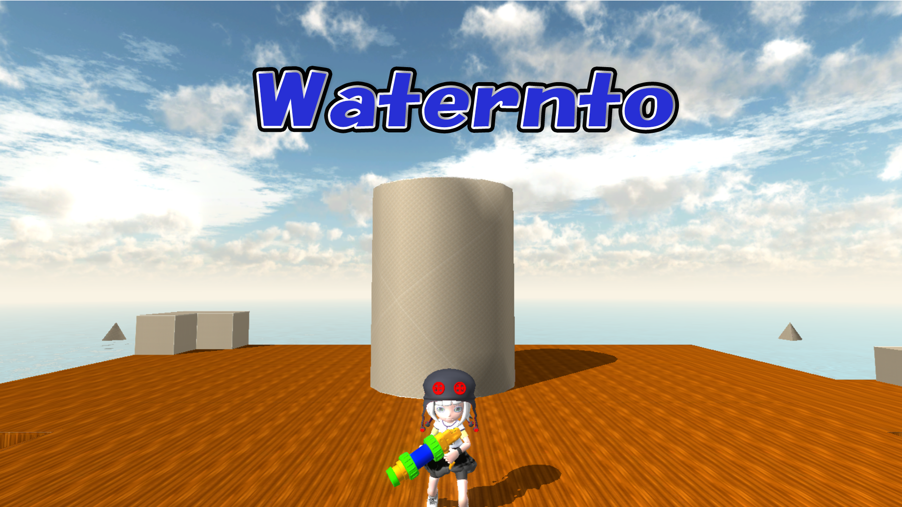</img> 

  - ３人称視点のアクション型のタワーディフェンスゲームです。   
     フェーズ制となっており、敵は中央にあるタワーを塗りにきます。  
     タワーが塗りつぶされる前に敵を全員倒し、全てのフェーズを乗り切ることでゲームクリアとなります。

- 使用ゲームエンジン 
  - 学校内製エンジンを改造して使用 
- 使用ツール 
  - Visual Studio 2019  
  - 3ds Max 2021  
  - Adobe Photoshop 2022   
  - Git  
- 使用言語 
  - C++  
  - HLSL  
- 使用ライブラリ
  - EffekSeer
- 開発環境 
  - Windows10   
  - DirectX12  
- 制作人数 
  - 1人  
- 開発期間 
  - 2022年9月～2023年2月  

# 2. 操作説明

- RB1ボタン  ：攻撃、射撃  
- Lスティック ：移動  
- Rスティック ：カメラの回転  

  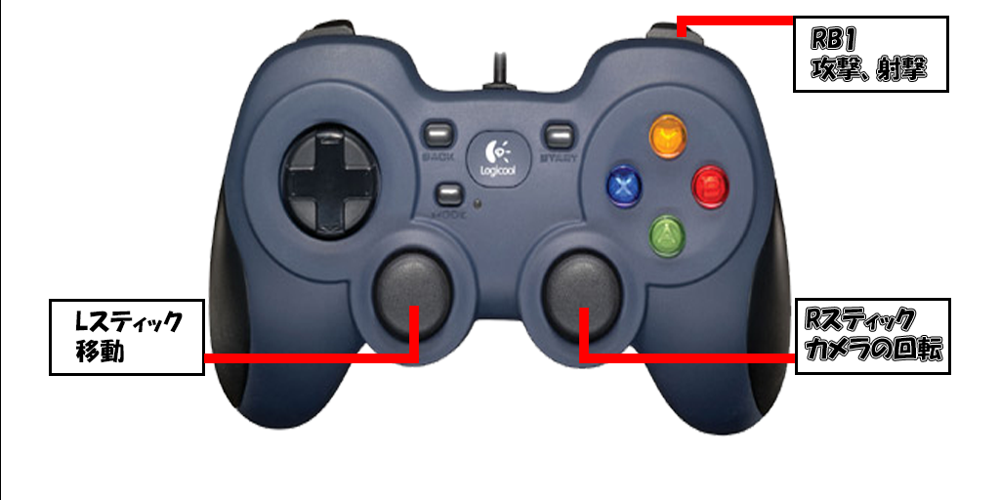</img> 

# 3.塗りの処理

- 塗りの処理を行うために何をしているのかを、先に簡単に説明します。   

1. ポリゴンとレイの当たり判定を取る。  
   
  この時、ポリゴンの1頂点を平面、レイを線分と仮定し、以下の処理を行います。   
  

1. 平面と線分の交点を求める。  

2.  2で求めた交点が三角形の内側にあるかどうかを求める。  
  
   三角形はポリゴンの三頂点の座標から求めたものです。
  

1. ワールド座標からUV座標に変換する。  

2. 求めたUV座標を中心としてインクのテクスチャを貼る。  

##  3.1.平面と線分の交差判定を行う  
1. 内積を使って平面と線分の交差判定を行います。  
2. 平面の平面方程式から平面上の点Pと法線Nが分かるので、PAベクトル、PBベクトルをそれぞれ法線Nと内積を行います。   
3. 片方がプラス、片方がマイナスなら交差している。  
   線端が平面上にある場合は内積が0になります。  

   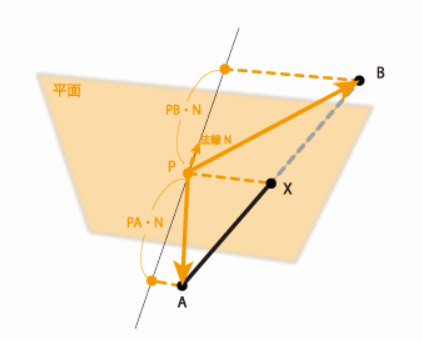</img> 
  
##  3.2.平面と線分の交点を求める
- 3.1の内積の結果は、AXとXBの距離の比率を表しているので、ベクトルABをその比率で分割すれば交点Xが求まります。
1. レイの終了座標から開始座標へのベクトル（以下BAベクトル）を計算します。
2. 先程求めた内積を使い、比率を求めます。
3. BAベクトルに2で求めた比率を乗算し、交点の座標を求めます。

## 3.3.三角形の内側に点があるかどうかを求める
- 求めた交点の座標がポリゴンからなる、三角形の中に含まれているかどうかの判定を取ります。  
1. 3頂点の座標と交点の座標をそれぞれ減算をした値を求めます。
2. 1で求めた値を使い外積を求めます。
3. 2で求めた外積ベクトルの向きが揃っていた場合、三角形の中に点があります。  
  
   ▼三角形の中に点がある場合  
   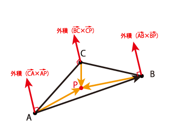</img> 
   ▼三角形の外に点がある場合  
   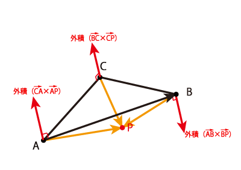</img>   

## 3.4.交点の座標をワールド座標からUV座標に変換

- 交点のワールド座標と三頂点のワールド座標を使い、交点のUV座標を求めます。  
   三角形の面積の比から求めることが出来ます。

1. 頂点から頂点、頂点から交点の値を減算する。
2. 1の値を使い外積を求めます。
3. 2で求めた外積ベクトルの長さを取得し、0.5倍することで面積の比率を求めることが出来ます。  
4. 3で求めた値を三頂点のUV座標に乗算する。
5. 4で求めたX座標とY座標、それぞれ３つの値を全て加算することで、交点のUV座標を求めることが出来ます。  

## 3.5.求めたUV座標にインクのテクスチャを貼る
- 交点のUV座標を中心としてインクのテクスチャを貼ります。

## 3.6.塗りの映像
- 上記の処理を行うことによって、塗りの処理を実装することに成功。   
   ▼塗りの映像  
   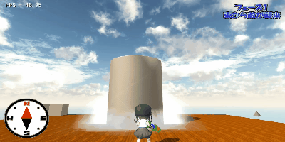</img> 

# 4.ブルーム

- 川瀬式ブルームを実装。  
   1. 通常シーンをオフスクリーンレンダリング後、輝度が高いピクセルを抽出する。    
   2. ブラーとダウンサンプリングをかけながら複数枚のテクスチャを作成する。    
   3. 複数枚のテクスチャの平均を取って加算合成する。  
  
   ▼通常シーン  
   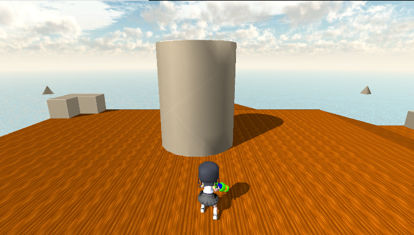</img> 
   ▼輝度抽出したテクスチャ  
   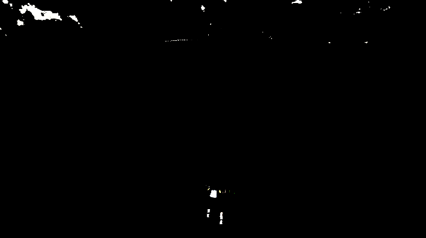</img> 
   ▼ブラーをかけながらダウンサンプリングしたテクスチャ  
   </img> 
   ▼加算合成後  
   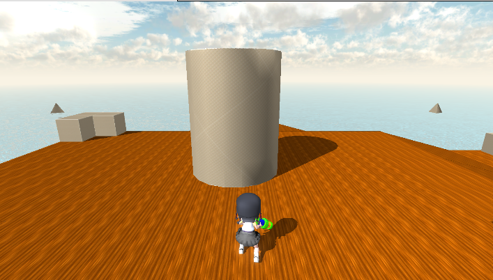</img>   

# 5.経路探索による移動処理

## 5.1.ナビゲーションメッシュ
ゲーム内でキャラクターが通れる場所を凸多角形で覆った集合と、それらを結ぶ線であるリンク情報を網目状に張り巡らせてゲーム世界を表現するもので、それぞれのメッシュが隣りあったメッシュのリンクデータを持っています。  
これをパス検索で計算することでメタAIやキャラクターAIに地図や地形などを認識させることができます。  

## 5.2.A*アルゴリズム
A*アルゴリズムとは、探索アルゴリズムの一種です。経路をノードで表現して、スタートノード（開始地点）からゴールノード（目標地点）までの経路を計算し、この経路が最短であることを保証するアルゴリズム。  

   ▼ステージ  
   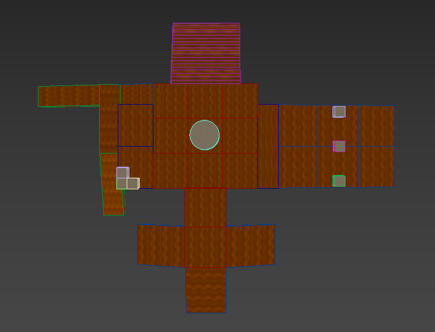</img> 

   - 「障害物」がある部分のポリゴンを切り抜く。
   - 「地面」の部分に当たるモデルの頂点数多くすることによって、  
       処理が少し重くなるが、より自然な動きをするようになります。
  
   ▼地形データ  
   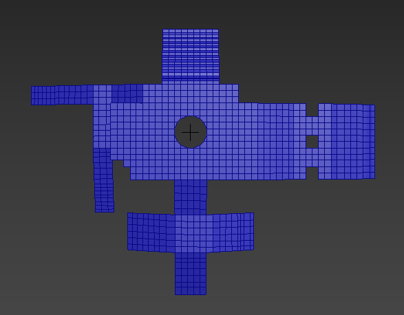</img> 
# 6.こだわった部分  

## 6.1.インク関連の処理
- 元々は交点のUV座標から一定の範囲内に、インクのテクスチャの中央部分を貼るという処理をしていたが、これだときれいな円になってしまい、インクのように見えなかったため変更することにしました。

   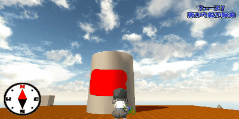</img> 

- 交点のUV座標を中心として正方形になるように範囲を決めます。
   決めた範囲から正規化スクリーン座標系の左上{0,0}と右下{1,1}を決めて、テクスチャを貼ります。

   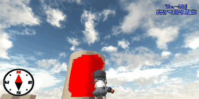</img> 
  
## 6.2.水の透過処理

- フラネル反射     
  屈折率の異なる物質が接触している境界面に光を入射させると一部の光が反射されます。  
  この反射をフレネル反射といい、反射の大きさは屈折率の差と入射角に依存します。  
  反射率を少し弱くして、水の透き通り具合を調整しています。
  
   ▼上の方から水を覗いたとき  
   </img> 
   ▼横の方から水を覗いたとき  
   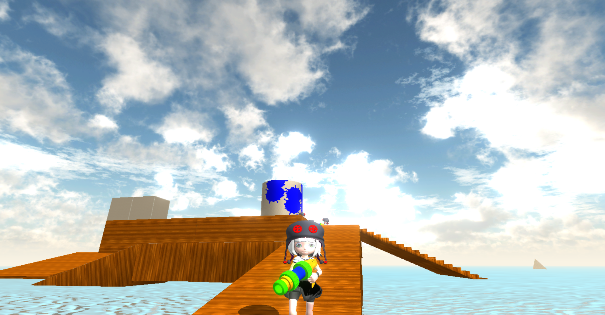</img>   

## 6.3.敵のAI

- 塗りの処理の調整   
   塗ってほしい場所をあらかじめパスで設定をして置き、乱数でパスを選択するようにし、塗った場所に行かないようにすることで、ランダムな場所を塗るように調整し、かつ同じ場所を塗ることがないようにしました。  

   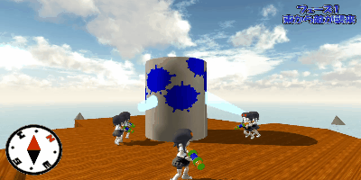</img> 

## 6.4.タワー
- 塗り替えし    
   プレイヤーはタワーを塗り替えすことが出来るが、フェーズ間の時も塗れてしまうと簡単に全ての場所を塗り替えすことができるので、フェーズ間の時はタワーを下に沈めプレイヤーが塗れないように修正しました。  

   ▼フェーズ開始時  
   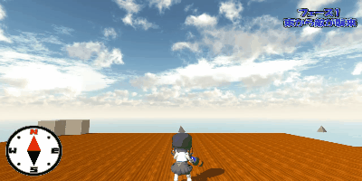</img> 
   ▼フェーズ終了時  
   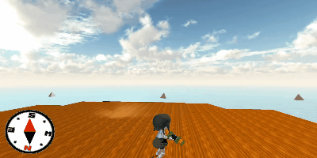</img> 

# 7.反省点、これから実装したいこと  
## 7.1.反省点
- インクの処理に時間をかけすぎて、他のインゲームの部分がおろそかになってしまった。  

## 7.2.これから実装したいこと
- 敵の種類を増やす、AIの性能UP
- グラフィック面の向上

