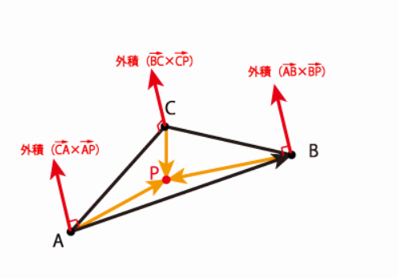
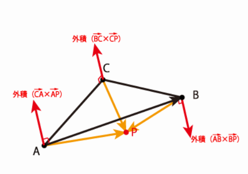
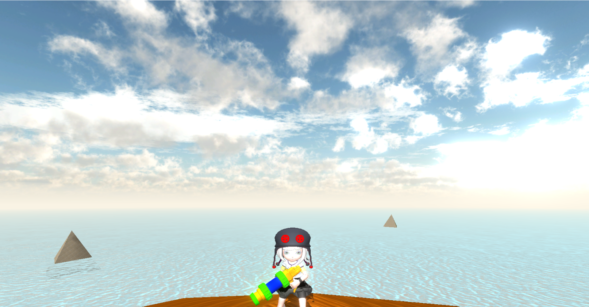

# waternto
河原電子ビジネス専門学校  
ゲームクリエイター科2年　中谷来斗  
# 目次

- [waternto](#waternto)
- [目次](#目次)
- [1. 作品概要](#1-作品概要)
  - [・waternto(ウォータント)](#waterntoウォータント)
  - [・使用ゲームエンジン](#使用ゲームエンジン)
  - [・使用ツール](#使用ツール)
  - [・使用言語](#使用言語)
  - [・使用ライブラリ](#使用ライブラリ)
  - [・開発環境](#開発環境)
  - [・制作人数](#制作人数)
  - [・開発期間](#開発期間)
- [2. 操作説明](#2-操作説明)
- [3.塗りの処理](#3塗りの処理)
  - [3.1.平面と線分の交差判定を行う](#31平面と線分の交差判定を行う)
  - [3.2.平面と線分の交点を求める](#32平面と線分の交点を求める)
  - [3.3.三角形の内側に点があるかどうかを求める](#33三角形の内側に点があるかどうかを求める)
  - [3.4マップへの塗りの処理の実装](#34マップへの塗りの処理の実装)
- [4.ブルーム](#4ブルーム)
- [5.経路探索](#5経路探索)
- [6.シャドウ](#6シャドウ)
- [7.ゲームでこだわった部分](#7ゲームでこだわった部分)
  - [7.1.フォグ](#71フォグ)
  - [7.2.水の透過処理](#72水の透過処理)

# 1. 作品概要 
## ・waternto(ウォータント) 
３人称視点のアクション型タワーディフェンスゲームです。 

    
## ・使用ゲームエンジン 
学校内製エンジンを改造して使用 
## ・使用ツール 
Visual Studio 2019  
3ds Max 2021  
Adobe Photoshop 2022   
Git  
## ・使用言語 
C++  
HLSL  
## ・使用ライブラリ
EffekSeer
## ・開発環境 
Windows10   
DirectX12  
## ・制作人数 
1人  
## ・開発期間 
2022年9月～2023年2月  

# 2. 操作説明

・RB1ボタン  ：攻撃、射撃  
・Lスティック ：移動  
・Rスティック ：カメラの回転  

  </img> 

# 3.塗りの処理

 
塗りの処理を行うために、ポリゴンとレイの当たり判定を取る必要がある。  
 ポリゴンとレイの当たり判定を取るため、ポリゴンの頂点を平面、    
 レイを線分と仮定し、以下の処理を行う。  

  - [3.1.平面と線分の交差判定を行う](#31平面と線分の交差判定を行う)
  - [3.2.平面と線分の交点を求める](#32平面と線分の交点を求める)
  - [3.3.三角形の内側に点があるかどうかを求める](#33三角形の内側に点があるかどうかを求める)
  - [3.4マップへの塗りの処理の実装](#34マップへの塗りの処理の実装)

##  3.1.平面と線分の交差判定を行う  
はじめに、内積を使って平面と線分の交差判定を行います。  
平面の平面方程式から平面上の点Pと法線Nが分かるので、  
PAベクトル、PBベクトルをそれぞれNと内積して、  
片方がプラス、片方がマイナスなら交差していると判断できます。
  </img> 
  
##  3.2.平面と線分の交点を求める
1. レイの終了座標から開始座標へのベクトル（以下BAベクトル）を計算します。
2. 先程求めた内積を使い、比率を求めます。
3. BAベクトルに2で求めた比率を乗算し、交点の座標を求めます。

## 3.3.三角形の内側に点があるかどうかを求める
求めた交点の座標がポリゴンからなる、三角形の中に含まれているかどうかの判定を取ります。  
1. 3頂点の座標と交点の座標をそれぞれ減算をした値を求めます。
2. 1で求めた値を使い外積を求めます。
3. 2で求めた外積ベクトルの向きが揃っていた場合、三角形の中に点があります  
▼三角形の中に点がある場合　　
</img> 
▼三角形の外に点がある場合　　
</img>   

## 3.4マップへの塗りの処理の実装
1. 衝突点のワールド座標から3頂点のUV座標を求めます。  
2. 求めた3頂点のUV座標を使い、ぶつかった点のUV座標を計算する。
3. 求めたUV座標を中心として、インクをテクスチャにオフスクリーンレンダリングする。  

</img> 

# 4.ブルーム

川瀬式ブルームを実装。  
1.通常シーンをオフスクリーンレンダリング後、輝度が高いピクセルを抽出する。    
2.ブラーとダウンサンプリングをかけながら複数枚のテクスチャを作成する。    
3.複数枚のテクスチャの平均を取って加算合成する。  
  
▼通常シーン  
 </img> 
▼輝度抽出したテクスチャ  
</img> 
▼ブラーをかけながらダウンサンプリングしたテクスチャ  
</img> 
▼加算合成後  
</img>   

# 5.経路探索

3dsMAXで地形データを作成し、レベルで保存 読み込みを行う。  
読み込んだ地形データを元に移動するようする。  

▼ステージ  
</img> 
▼地形データ  
</img> 

# 6.シャドウ
▼シャドウマップ  
  </img> 
▼影を描画  
</img>   

# 7.ゲームでこだわった部分  
## 7.1.フォグ

フォグを使うことにより、海と空の境界線を違和感のないようにしている  

▼フォグあり  
  </img> 
▼フォグなし  
</img>   

## 7.2.水の透過処理

 カメラの角度によって水の透過具合を変更している  

 
▼透過あり  
  </img> 
▼透過なし  
</img>   

